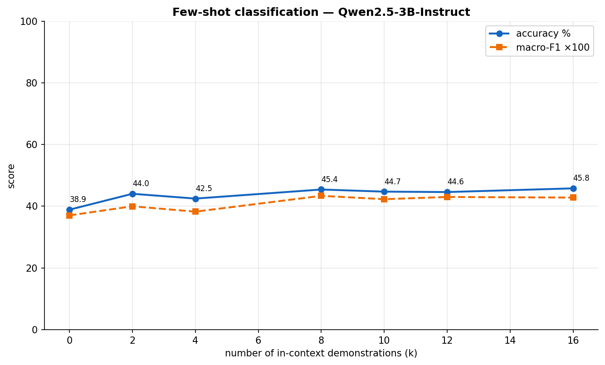
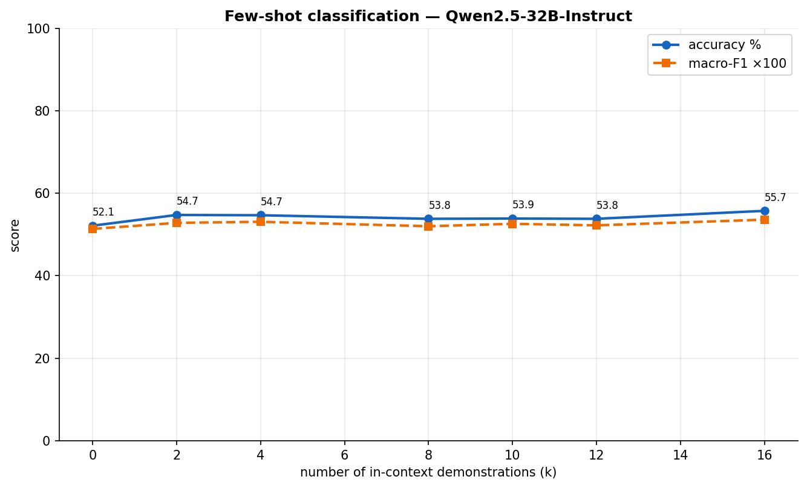
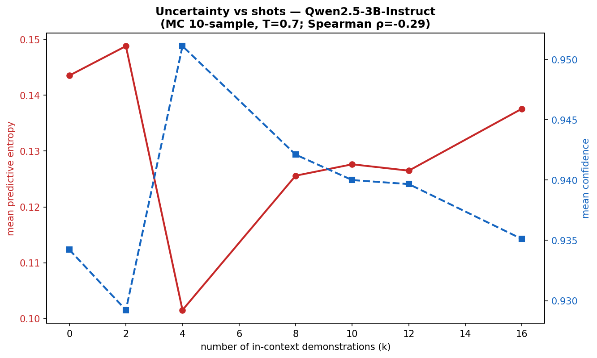
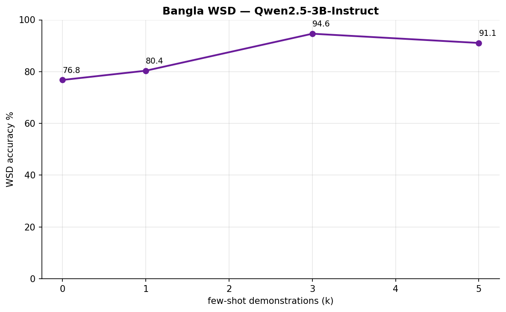
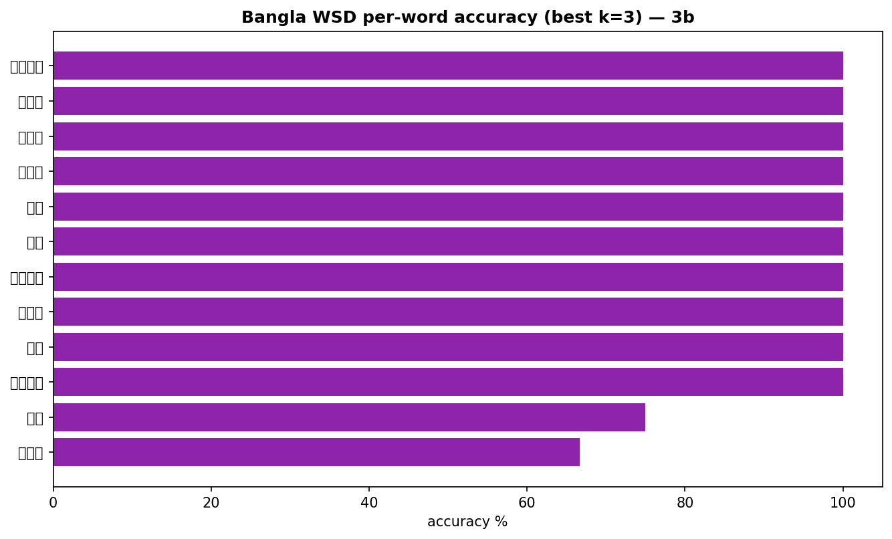
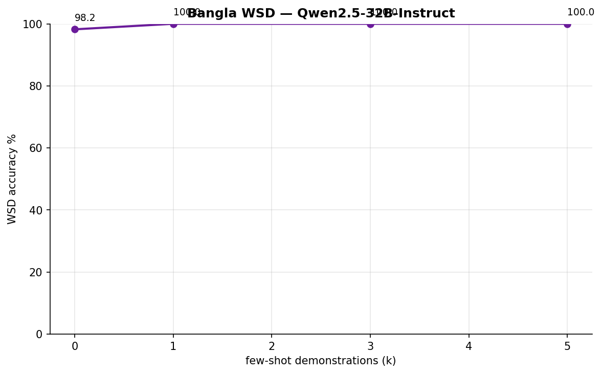
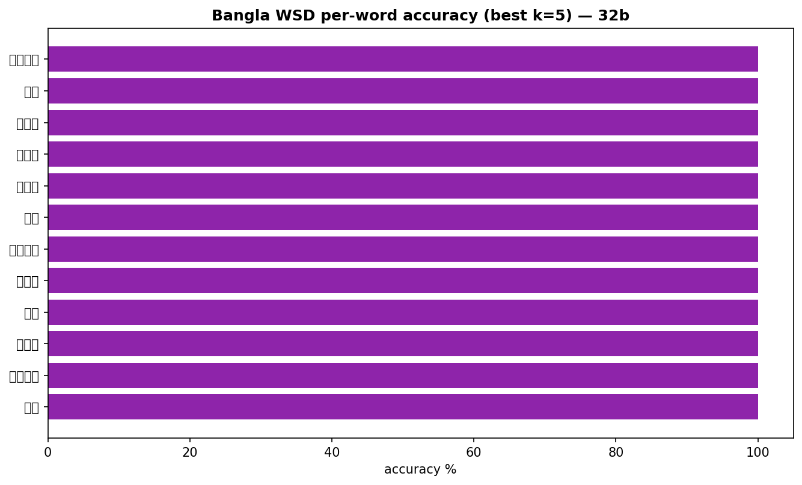
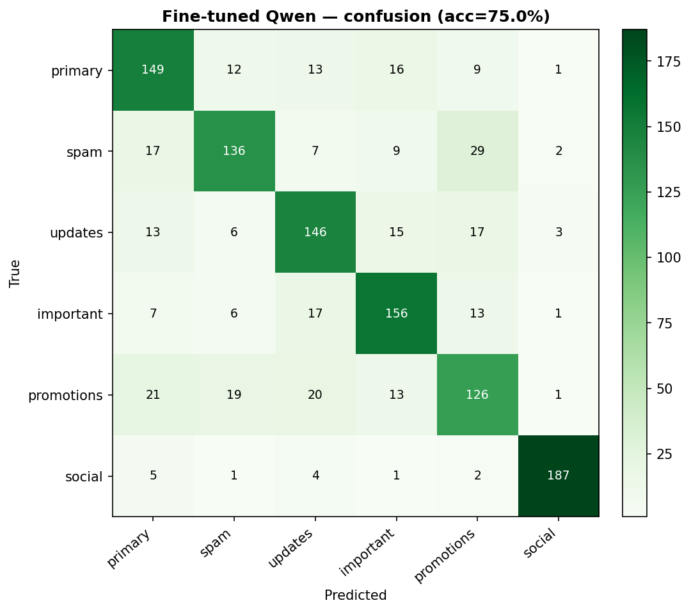
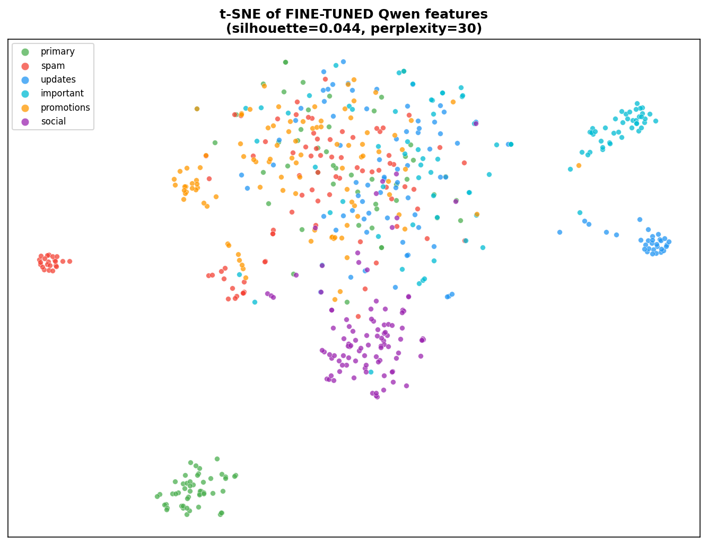
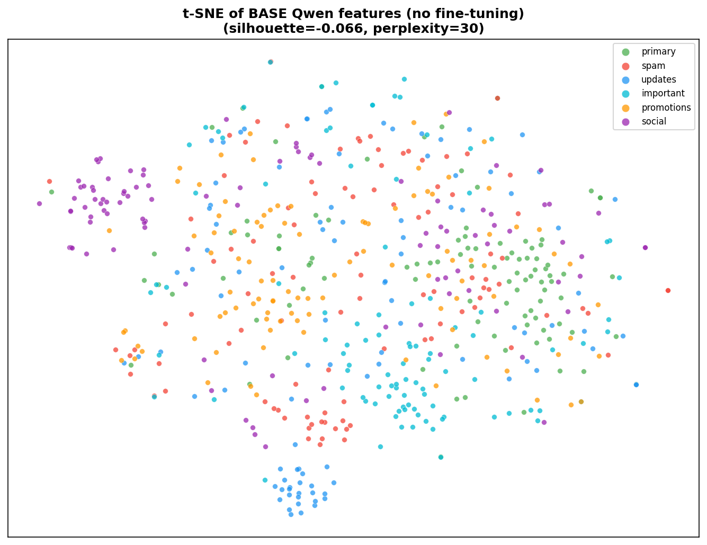

# MJ2026

Balanced Bangla-email dataset + classification experiments (thesis data-creation step).

**Reproducibility:** see [REPRODUCIBILITY.md](REPRODUCIBILITY.md) — pinned env, global seed 42, per-step run commands.

# Bangla Email Dataset — Data Creation Report

Generation model: `Qwen/Qwen2.5-3B-Instruct` · wall-clock: n/a

## 1. The problem: the raw corpus is imbalanced

The raw corpus has **7,045** emails with a **1.37×** imbalance between the largest and smallest class (min 1020 `important` … max 1401 `updates`). Class imbalance depresses per-class precision/recall, which is exactly what the zero-shot evaluation showed.

## 2. The fix: balance every class to a fixed target

Every class is up-sampled to **2,000** (real kept, only the deficit synthesised), giving a perfectly balanced **12,000-email** dataset.

| category   |   real |   synthetic |   total |
|:-----------|-------:|------------:|--------:|
| primary    |   1023 |         977 |    2000 |
| spam       |   1234 |         766 |    2000 |
| updates    |   1401 |         599 |    2000 |
| important  |   1020 |         980 |    2000 |
| promotions |   1324 |         676 |    2000 |
| social     |   1043 |         957 |    2000 |

Balanced? **YES — all classes equal** (per-class counts: [np.int64(2000)]).

## 3. Composition & length

## Zero-shot classification on the balanced set

Model: `Qwen/Qwen2.5-3B-Instruct` · overall accuracy: **44.9%** · macro-F1: **0.421**

| category   |   precision |   recall |    f1 |   support |
|:-----------|------------:|---------:|------:|----------:|
| primary    |       0.422 |    0.172 | 0.244 |       250 |
| spam       |       0.542 |    0.128 | 0.207 |       250 |
| updates    |       0.531 |    0.452 | 0.488 |       250 |
| important  |       0.456 |    0.608 | 0.521 |       250 |
| promotions |       0.342 |    0.8   | 0.479 |       250 |
| social     |       0.644 |    0.536 | 0.585 |       250 |

## Files

- `Bangla_Email_Dataset_Augmented.csv` / `.xlsx` — the balanced dataset
- `tables/` — CSV tables · `figures/` — PNGs · `tables/sample_emails.md` — samples

# Experiments — classification performance

All evaluations use the balanced 250/class split (1,500 emails) unless noted. Zero-shot/few-shot are in-context (no weight updates); fine-tune is LoRA on the balanced 12k training split with a held-out test set.

## Few-shot (in-context) — Qwen2.5-3B-Instruct

|   shots (k) |   accuracy % |   macro-F1 |   valid preds |
|------------:|-------------:|-----------:|--------------:|
|           0 |         38.9 |      0.37  |          1499 |
|           2 |         44   |      0.4   |          1494 |
|           4 |         42.5 |      0.382 |          1497 |
|           8 |         45.4 |      0.434 |          1497 |
|          10 |         44.7 |      0.423 |          1500 |
|          12 |         44.6 |      0.43  |          1500 |
|          16 |         45.8 |      0.428 |          1500 |

Best: **k=16** → accuracy **45.8%**, macro-F1 **0.428**.

## Few-shot (in-context) — Qwen2.5-32B-Instruct

|   shots (k) |   accuracy % |   macro-F1 |   valid preds |
|------------:|-------------:|-----------:|--------------:|
|           0 |         52.1 |      0.514 |          1500 |
|           2 |         54.7 |      0.528 |          1500 |
|           4 |         54.7 |      0.531 |          1500 |
|           8 |         53.8 |      0.52  |          1500 |
|          10 |         53.9 |      0.526 |          1500 |
|          12 |         53.8 |      0.522 |          1500 |
|          16 |         55.7 |      0.536 |          1500 |

Best: **k=16** → accuracy **55.7%**, macro-F1 **0.536**.

## Uncertainty quantification (MC multi-sampling) — Qwen2.5-3B-Instruct

Hypothesis: more in-context shots reduce predictive uncertainty. For each k we draw 10 stochastic samples (T=0.7) per email and measure the predictive entropy / variation-ratio over the sampled labels.

|   shots (k) |   entropy↓ |   variation-ratio↓ |   confidence↑ |   maj-vote acc |
|------------:|-----------:|-------------------:|--------------:|---------------:|
|           0 |      0.144 |              0.066 |         0.934 |          0.38  |
|           2 |      0.149 |              0.071 |         0.929 |          0.413 |
|           4 |      0.102 |              0.049 |         0.951 |          0.429 |
|           8 |      0.126 |              0.058 |         0.942 |          0.444 |
|          10 |      0.128 |              0.06  |         0.94  |          0.439 |
|          12 |      0.126 |              0.06  |         0.94  |          0.439 |
|          16 |      0.138 |              0.065 |         0.935 |          0.432 |

Spearman ρ(k, entropy) = **-0.286** (p=0.535) — negative (supports the hypothesis), NOT statistically significant. The model is already highly confident even at k=0 (entropy ≈ 0.14), so the reduction is small; entropy is lowest at k=4.

## Word Sense Disambiguation (Bangla homonyms)

A self-contained, gold-labelled benchmark of ambiguous Bangla words (e.g. **চাল** = uncooked rice / a clever move / a roof; **মান** = quality / honor / mathematical value). Lexical-sample WSD: given the word, a context sentence and the candidate sense glosses, the model picks the right sense. Zero-shot and few-shot (demonstrations drawn from *other* words — no leakage).

**Qwen2.5-3B-Instruct** — 56 instances, best **94.6%** at k=3:

|   shots (k) |   WSD accuracy % |   n |
|------------:|-----------------:|----:|
|           0 |             76.8 |  56 |
|           1 |             80.4 |  56 |
|           3 |             94.6 |  56 |
|           5 |             91.1 |  56 |

**Qwen2.5-32B-Instruct** — 56 instances, best **100.0%** at k=1:

|   shots (k) |   WSD accuracy % |   n |
|------------:|-----------------:|----:|
|           0 |             98.2 |  56 |
|           1 |            100   |  56 |
|           3 |            100   |  56 |
|           5 |            100   |  56 |

## Fine-tuning (LoRA) — the >0.70 result

`Qwen/Qwen2.5-3B-Instruct` LoRA-fine-tuned for 6-way classification (train=9600, test=1200, epochs=3.0):

| metric | value |
|---|---|
| **test accuracy** | **75.00%** |
| **test macro-F1** | **0.750** |

✅ exceeds the 0.70 target.

Per-class (test):

| category   |   precision |   recall |    f1 |   support |
|:-----------|------------:|---------:|------:|----------:|
| primary    |       0.703 |    0.745 | 0.723 |       200 |
| spam       |       0.756 |    0.68  | 0.716 |       200 |
| updates    |       0.705 |    0.73  | 0.717 |       200 |
| important  |       0.743 |    0.78  | 0.761 |       200 |
| promotions |       0.643 |    0.63  | 0.636 |       200 |
| social     |       0.959 |    0.935 | 0.947 |       200 |

### t-SNE clustering (resolved)

Mean-pooled hidden-state features, L2-normalised, cosine t-SNE. Fine-tuning sharpens the class clusters: silhouette **-0.066 → 0.044**.

