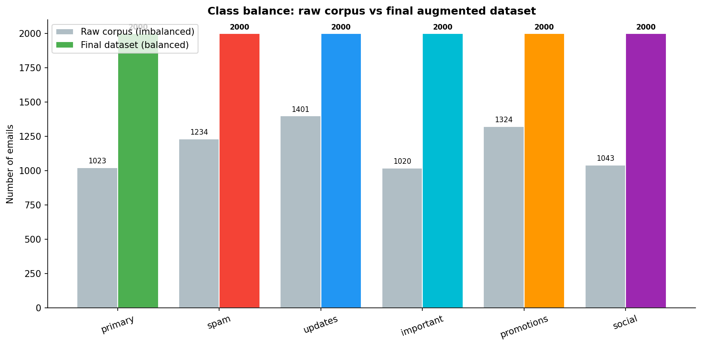
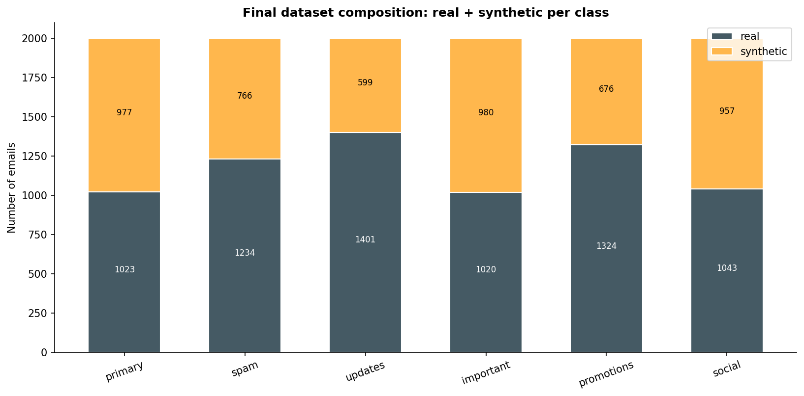
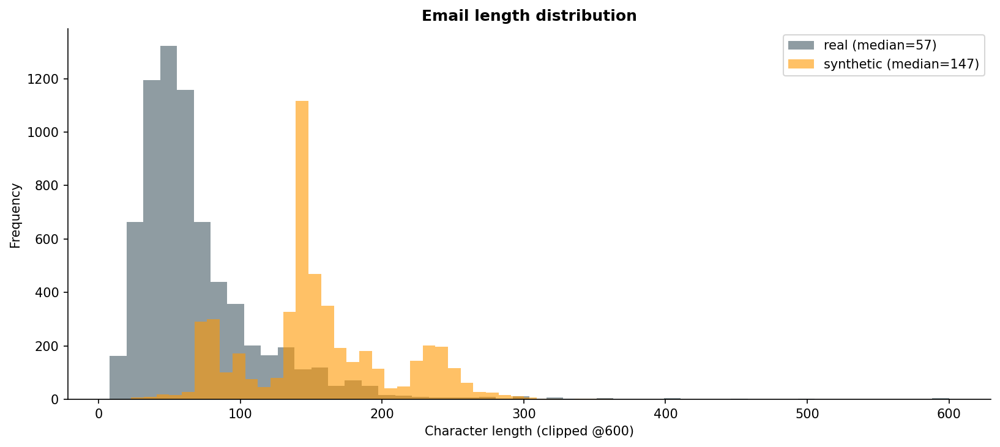
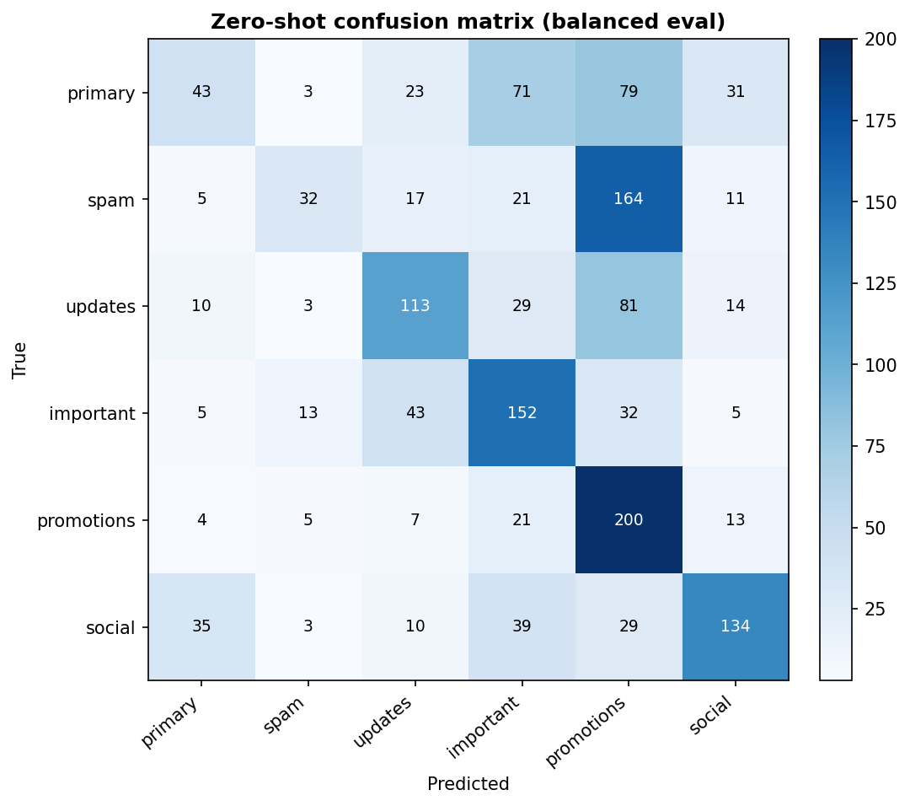
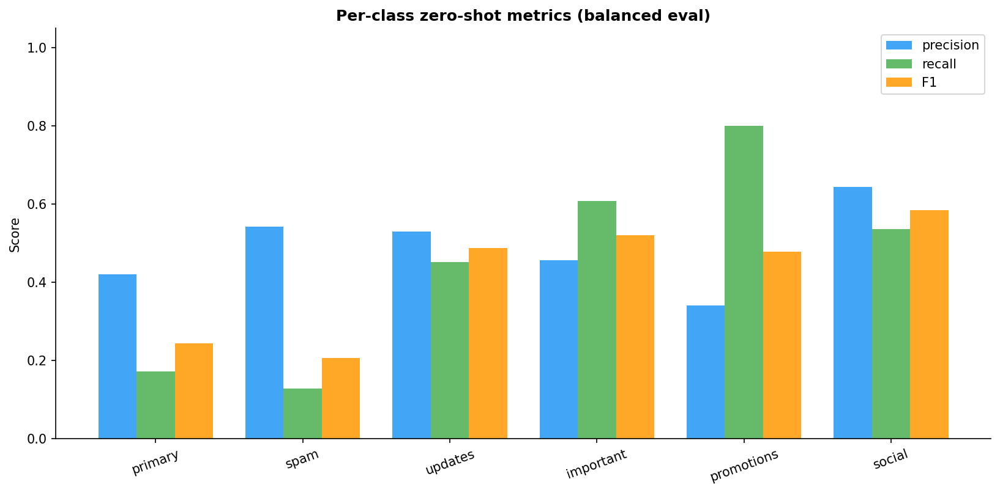

# MJ2026

Balanced Bangla-email dataset for thesis — data-creation step.

# Bangla Email Dataset — Data Creation Report

Generation model: `Qwen/Qwen2.5-3B-Instruct` · wall-clock: n/a

## 1. The problem: the raw corpus is imbalanced

The raw corpus has **7,045** emails with a **1.37×** imbalance between the largest and smallest class (min 1020 `important` … max 1401 `updates`). Class imbalance depresses per-class precision/recall, which is exactly what the zero-shot evaluation showed.

## 2. The fix: balance every class to a fixed target

Every class is up-sampled to **2,000** (real kept, only the deficit synthesised), giving a perfectly balanced **12,000-email** dataset.

| category   |   real |   synthetic |   total |
|:-----------|-------:|------------:|--------:|
| primary    |   1023 |         977 |    2000 |
| spam       |   1234 |         766 |    2000 |
| updates    |   1401 |         599 |    2000 |
| important  |   1020 |         980 |    2000 |
| promotions |   1324 |         676 |    2000 |
| social     |   1043 |         957 |    2000 |

Balanced? **YES — all classes equal** (per-class counts: [np.int64(2000)]).

## 3. Composition & length

## Zero-shot classification on the balanced set

Model: `Qwen/Qwen2.5-3B-Instruct` · overall accuracy: **44.9%** · macro-F1: **0.421**

| category   |   precision |   recall |    f1 |   support |
|:-----------|------------:|---------:|------:|----------:|
| primary    |       0.422 |    0.172 | 0.244 |       250 |
| spam       |       0.542 |    0.128 | 0.207 |       250 |
| updates    |       0.531 |    0.452 | 0.488 |       250 |
| important  |       0.456 |    0.608 | 0.521 |       250 |
| promotions |       0.342 |    0.8   | 0.479 |       250 |
| social     |       0.644 |    0.536 | 0.585 |       250 |

## Files

- `Bangla_Email_Dataset_Augmented.csv` / `.xlsx` — the balanced dataset
- `tables/` — CSV tables · `figures/` — PNGs · `tables/sample_emails.md` — samples
